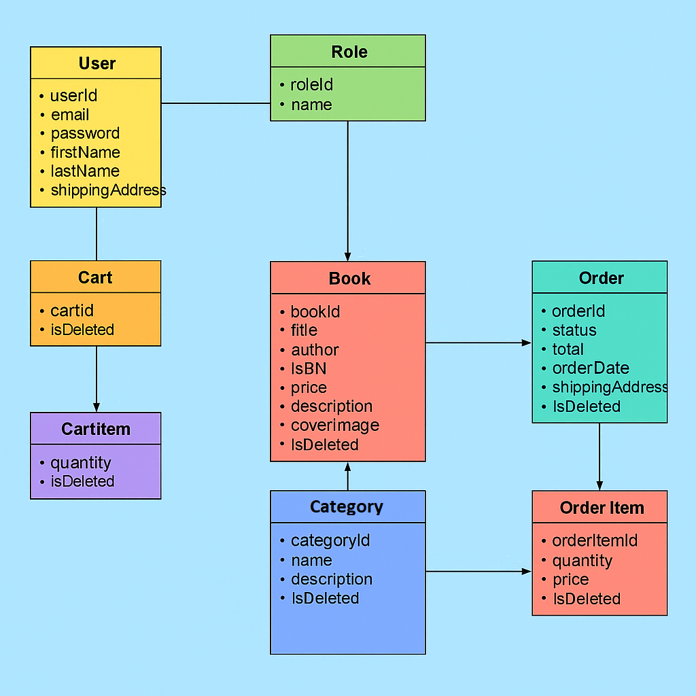
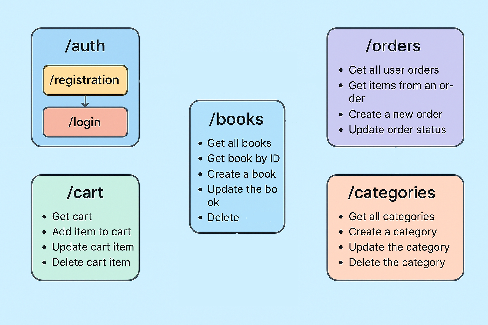

# Bookstore

This application provides the following functionality:

📝 User registration and authentication

📖 Browsing a list of available books

🔍 Searching and sorting books by categories or other parameters

🛒 Adding books to a shopping cart

📦 Placing and managing orders

**Model diagram:**

The development of the Bookstore application involved the following technologies:

**Functional**

User capabilities:
1. Register and log in.
2. View all books, sort them by category, or search by title/author/isbn.
3. Add books to the cart, update or remove them.
4. Create an order and track its status.

Admin capabilities:
1. Create, update, or delete book categories and books.
2. Soft deletion is enabled, allowing you to restore deleted items if needed.

**Book-market`s endpoints:**

	Auth (/auth):
            GET: /registration - Register a new user
            GET: /login - Retrieve a token for Bearer authentication

	Book (/books):
            GET: / - Retrieve a list of books
            POST: / - Add a new book (ADMIN only)
            PUT: /{id} - Update a book by ID (ADMIN only)
            DELETE: /{id} - Soft delete a book (ADMIN only)
            GET: /search - Search for books using parameters

	Categories (/categories):
            GET: / - Retrieve a paginated list of categories
            POST: / - Create a new category (ADMIN only)
            PUT: /{id} - Update a category by ID (ADMIN only)
            GET: /{id} - Retrieve a category by ID
            DELETE: /{id} - Soft delete a category (ADMIN only)
            GET: /{id}/books - Retrieve books by category

	Cart (/cart):
            GET: / - Retrieve the authenticated user's cart
            POST: / - Add an item to the cart
            PUT: /item/{cartItemId} - Update the quantity of an item in the cart
            DELETE: /item/{cartItemId} - Soft delete an item from the cart

	Orders (/orders):
            GET: / - Retrieve a paginated list of user orders
            GET: /{id}/items - Retrieve items in a user's order
            GET: /{id}/items/{orderId} - Retrieve a specific item from an order
            POST: / - Create a new order
            PATCH: /{id} - Update order status (ADMIN only)

**Running Book-market:**

Docker:
1. Install Docker Desktop (if not installed).

2. Configure the .env file with your settings.

3. Open the terminal and run the following commands:

`docker-compose build  # Build the images `

`docker-compose up     # Start the project`

`docker-compose down   # Stop the project`

Running Locally
1. Open application.properties.

2. Set the required database properties:
    * Database URL
    * Username
    * Password

3. Press "run"